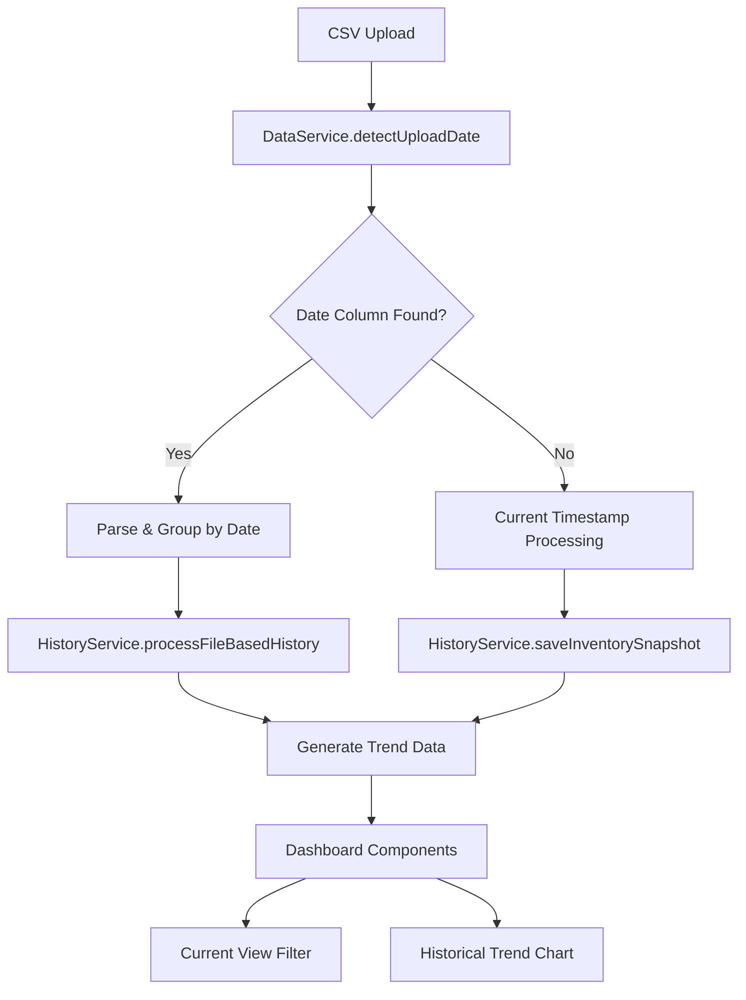

# Design Document: Reliable Inventory History Management

## Overview

This design outlines the enhancement of inventory history management to provide more reliable and accurate historical tracking. The system will transition from localStorage-based snapshots to file-based cumulative history using Upload Date columns, enabling better trend analysis and data integrity.

The key architectural shift involves three main components:
1. **Data Model Enhancement** - Adding uploadDate support to core interfaces
2. **Service Refactoring** - Implementing auto-detection and history coordination
3. **Component Protection** - Ensuring current view components only see latest data

## Architecture

### Current State Analysis

The existing system uses:
- `DataService.ts` for CSV parsing and validation
- `HistoryService.ts` for localStorage-based snapshot management
- Platform-aware data structures with `InventoryItem` and `InventorySnapshot` interfaces

### Enhanced Architecture



## Components and Interfaces

### 1. Data Model Enhancement

#### Enhanced InventoryItem Interface
```typescript
export interface InventoryItem {
  // Existing fields...
  itemId: string;
  itemName: string;
  totalSellable: number;
  warehouseFacilityId: string;
  // ... other existing fields
  
  // NEW: Upload date support
  uploadDate?: Date | string; // Optional for backward compatibility
  platform?: Platform;
}
```

#### Enhanced InventorySnapshot Interface
```typescript
export interface InventorySnapshot {
  timestamp: Date;
  itemId: string;
  warehouseFacilityId: string;
  totalSellable: number;
  uploadSource: string;
  platform: Platform;
  
  // NEW: File-based date support
  fileUploadDate?: Date; // When present, indicates file-based history
  isFileBasedHistory: boolean; // Flag to distinguish from localStorage snapshots
  
  platformMetadata: {
    uploadSource: string;
    dataFormat: 'blinkit' | 'amazon';
    recordCount: number;
    dateRange?: {
      earliest: Date;
      latest: Date;
      uniqueDates: number;
    };
  };
}
```

#### New CumulativeHistoryData Interface
```typescript
export interface CumulativeHistoryData {
  uploadDates: Date[];
  dataByDate: Map<string, InventoryItem[]>; // ISO date string -> items
  latestDate: Date;
  earliestDate: Date;
  totalDaysOfHistory: number;
}
```

### 2. Service Refactoring

#### DataService Enhancement

**New Methods:**
```typescript
class DataService {
  // NEW: Auto-detection logic for date columns
  static detectUploadDateColumn(csvData: any[]): string | null;
  
  // NEW: Parse and group data by upload date
  static parseFileBasedHistory(csvData: any[]): CumulativeHistoryData;
  
  // NEW: Enhanced master inventory loader with date support
  static async loadMasterInventoryDataWithHistory(file: File): Promise<{
    items: InventoryItem[];
    cumulativeHistory: CumulativeHistoryData | null;
    isHistoryFile: boolean;
  }>;
  
  // ENHANCED: Existing method with date detection
  static async loadInventoryData(file: File): Promise<InventoryItem[]>;
}
```

**Implementation Details:**

1. **Date Column Detection:**
   - Scan for columns: 'Upload Date', 'Date', 'Timestamp', 'Created Date'
   - Validate date formats: DD-MM-YYYY, MM/DD/YYYY, YYYY-MM-DD, ISO strings
   - Return the first valid date column found

2. **Data Grouping:**
   - Parse all dates and group inventory items by unique dates
   - Sort dates chronologically for proper trend progression
   - Handle duplicate dates by aggregating or using latest entry per item/location

3. **Backward Compatibility:**
   - If no date column found, process as single snapshot with current timestamp
   - Maintain existing CSV validation and transformation logic

#### HistoryService Refactoring

**Architectural Role Change:**
- **From:** Simple localStorage snapshot manager
- **To:** History Coordinator that prioritizes file-based dates

**New Methods:**
```typescript
class HistoryService {
  // NEW: Process file-based cumulative history
  static async processFileBasedHistory(
    cumulativeData: CumulativeHistoryData,
    uploadSource: string,
    platform: Platform
  ): Promise<void>;
  
  // NEW: Generate trend data from file dates (priority over localStorage)
  static generateFileBasedTrendData(
    cumulativeData: CumulativeHistoryData,
    platform?: Platform
  ): TrendData;
  
  // NEW: Get latest date slice for current view
  static getLatestDateSlice(
    cumulativeData: CumulativeHistoryData
  ): InventoryItem[];
  
  // NEW: Combine file-based and localStorage history
  static getCombinedHistoryData(
    fileHistory?: CumulativeHistoryData,
    platform?: Platform
  ): TrendData;
  
  // ENHANCED: Existing methods with file-based priority
  static generateInventoryTrendData(
    itemId?: string,
    facilityId?: string,
    platform?: Platform
  ): TrendData;
}
```

**Implementation Strategy:**

1. **File-Based Priority:**
   - When file contains multiple dates, use those as primary trend data
   - localStorage snapshots become secondary/supplementary
   - Immediate chart population after file upload

2. **History Coordination:**
   - Detect if uploaded file contains cumulative history
   - If yes, extract 30+ data points immediately
   - If no, fall back to localStorage snapshot accumulation

3. **Data Storage:**
   - Store file-based history separately from localStorage snapshots
   - Use sessionStorage for current file's cumulative data
   - Maintain localStorage for cross-session persistence

### 3. Component Protection

#### Current View Data Filtering

**ReplenishmentPlanner Protection:**
```typescript
// Ensure ReplenishmentPlanner only sees latest date data
const getFilteredInventoryForReplenishment = (
  allInventory: InventoryItem[],
  cumulativeHistory?: CumulativeHistoryData
): InventoryItem[] => {
  if (cumulativeHistory) {
    return HistoryService.getLatestDateSlice(cumulativeHistory);
  }
  return allInventory; // Fallback to all data if no history
};
```

**BentoGrid/KPI Protection:**
```typescript
// Ensure KPI calculations use only current data
const getCurrentViewMetrics = (
  inventory: InventoryItem[],
  cumulativeHistory?: CumulativeHistoryData
) => {
  const currentData = cumulativeHistory 
    ? HistoryService.getLatestDateSlice(cumulativeHistory)
    : inventory;
    
  return AnalyticsService.calculateKPIs(currentData);
};
```

**Guardrails for Business Logic:**
- 15-day lead time calculations applied only to latest date slice
- 18-day reorder point logic preserved for current view
- Historical dates used only for trend visualization
- No business logic changes to core replenishment algorithms

## Data Models

### Upload Date Detection Schema

```typescript
interface DateColumnDetection {
  columnName: string | null;
  dateFormat: 'DD-MM-YYYY' | 'MM/DD/YYYY' | 'YYYY-MM-DD' | 'ISO' | null;
  sampleDates: Date[];
  isValid: boolean;
  errorMessage?: string;
}
```

### File Processing Result

```typescript
interface FileProcessingResult {
  inventoryItems: InventoryItem[];
  cumulativeHistory: CumulativeHistoryData | null;
  processingMetadata: {
    isHistoryFile: boolean;
    dateColumnDetected: string | null;
    totalRecords: number;
    uniqueDates: number;
    dateRange: {
      earliest: Date;
      latest: Date;
    } | null;
    processingErrors: string[];
    processingWarnings: string[];
  };
}
```

## Correctness Properties

*A property is a characteristic or behavior that should hold true across all valid executions of a system-essentially, a formal statement about what the system should do. Properties serve as the bridge between human-readable specifications and machine-verifiable correctness guarantees.*

Now I'll analyze the acceptance criteria to determine which can be converted to testable properties:

<function_calls>
<invoke name="prework">
<parameter name="featureName">reliable-inventory-history

### Property Reflection

After reviewing all testable properties from the prework analysis, I've identified several areas where properties can be consolidated to eliminate redundancy:

**Consolidation Opportunities:**
- Properties 1.1, 1.2, and 1.5 (date column detection and parsing) can be combined into a comprehensive date handling property
- Properties 2.1, 2.4, and 2.5 (date extraction and processing) can be merged into a single date processing property  
- Properties 3.1, 3.2, and 3.5 (current view filtering) can be consolidated into one current view property
- Properties 4.1, 4.2, and 4.4 (UI feedback) can be combined into a comprehensive feedback property
- Properties 5.1, 5.4, and 5.5 (backward compatibility) can be merged into one compatibility property

This consolidation ensures each property provides unique validation value while avoiding overlapping test coverage.

### Correctness Properties

Based on the prework analysis and property reflection, here are the consolidated correctness properties:

**Property 1: Date Column Detection and Parsing**
*For any* CSV file with date columns in various formats ('Upload Date', 'Date', 'Timestamp', etc.), the system should correctly detect the date column, parse all valid dates, and provide clear error messages for invalid date formats
**Validates: Requirements 1.1, 1.2, 1.5**

**Property 2: Cumulative History Classification**
*For any* CSV file, when multiple unique dates exist, the system should classify it as cumulative history, and when no date column exists, it should fall back to timestamp-based processing
**Validates: Requirements 1.3, 1.4**

**Property 3: Date Processing and Aggregation**
*For any* cumulative history file, the system should extract unique dates, handle duplicate dates through appropriate aggregation, and sort dates chronologically for trend visualization
**Validates: Requirements 2.1, 2.4, 2.5**

**Property 4: Trend Chart File-Based Data**
*For any* file with Upload Date columns, the trend chart should use the file's dates as x-axis values and group metrics (Total Units, Out of Stock, Expiry Risk) by Upload Date rather than upload timestamps
**Validates: Requirements 2.2, 2.3**

**Property 5: Current View Data Filtering**
*For any* multi-date file, dashboard tables and KPI calculations should show only data from the most recent Upload Date, while files without date columns should display all data as current view
**Validates: Requirements 3.1, 3.2, 3.5**

**Property 6: Business Logic Preservation**
*For any* inventory data, replenishment calculations should use 15-day lead time and 18-day reorder point applied only to the latest date's data, maintaining view separation across UI state changes
**Validates: Requirements 3.3, 3.4**

**Property 7: UI Feedback Accuracy**
*For any* uploaded file, the system should display accurate feedback messages indicating cumulative history detection with correct day counts, date ranges, and appropriate messages for single-date files
**Validates: Requirements 4.1, 4.2, 4.4**

**Property 8: Immediate Chart Population**
*For any* file upload containing date columns, the trend chart should render data points immediately using file-based dates rather than waiting for localStorage accumulation
**Validates: Requirements 4.3**

**Property 9: Backward Compatibility**
*For any* file without date columns, the system should process using existing localStorage snapshot methods while preserving existing data and maintaining full functionality
**Validates: Requirements 5.1, 5.4, 5.5**

**Property 10: Data Format Compatibility**
*For any* combination of old and new data formats, the system should handle transitions seamlessly and combine file-based dates with localStorage snapshots appropriately
**Validates: Requirements 5.2, 5.3**

**Property 11: Date Validation and Quality**
*For any* Upload Date column, the system should validate date formats, reject invalid entries, warn about unrealistic date ranges, and ensure mathematical accuracy in metric aggregations
**Validates: Requirements 6.1, 6.4, 6.5**

**Property 12: Enhanced Analytics Features**
*For any* historical data, the system should support date-range filtering, period-over-period analysis using file dates, include Upload Date information in exports, and display both current and historical context where relevant
**Validates: Requirements 7.2, 7.3, 7.4, 7.5**

## Error Handling

### Date Parsing Errors
- **Invalid Date Formats**: Provide specific error messages indicating expected formats (DD-MM-YYYY, MM/DD/YYYY, YYYY-MM-DD)
- **Unparseable Dates**: Log warnings and skip invalid entries while processing valid ones
- **Mixed Date Formats**: Attempt multiple parsing strategies and warn about inconsistencies

### Data Quality Issues
- **Unrealistic Date Ranges**: Warn when dates span more than 5 years or include future dates beyond reasonable planning horizon
- **Duplicate Date Conflicts**: When same date has conflicting data for same item/location, use latest entry and log warning
- **Missing Date Values**: Treat empty date cells as invalid and exclude from history processing

### File Processing Errors
- **Large File Handling**: Implement streaming for files with >10,000 rows to prevent memory issues
- **Corrupted Data**: Gracefully handle CSV parsing errors and provide recovery suggestions
- **Network Interruptions**: Implement retry logic for file upload failures

### Backward Compatibility Errors
- **localStorage Corruption**: Detect and recover from corrupted localStorage data
- **Schema Migration**: Handle version differences between old and new data structures
- **Feature Degradation**: Ensure core functionality works even when new features fail

## Testing Strategy

### Dual Testing Approach

The testing strategy employs both unit tests and property-based tests to ensure comprehensive coverage:

**Unit Tests:**
- Specific examples of date parsing for known formats
- Edge cases like leap years, month boundaries, timezone handling
- Error conditions with malformed CSV files
- Integration between DataService and HistoryService components
- UI feedback message accuracy for specific scenarios

**Property-Based Tests:**
- Universal properties across all valid CSV inputs and date formats
- Comprehensive input coverage through randomized test data generation
- Mathematical correctness of metric aggregations across date ranges
- Data integrity preservation across format transitions
- Performance characteristics under various file sizes and date distributions

**Property Test Configuration:**
- Minimum 100 iterations per property test to ensure statistical confidence
- Each property test tagged with: **Feature: reliable-inventory-history, Property {number}: {property_text}**
- Use fast-check library for TypeScript property-based testing
- Custom generators for CSV data, date ranges, and inventory items

**Test Data Generation:**
- CSV files with various date column names and formats
- Multi-date files with 1-365 days of history
- Files with duplicate dates and conflicting data
- Invalid date formats and edge cases
- Large files (1000+ rows) for performance testing

**Integration Testing:**
- End-to-end file upload and chart rendering workflows
- Cross-browser compatibility for date parsing
- localStorage and sessionStorage interaction testing
- Platform switching with file-based history data

### Testing Framework Integration

**Jest + fast-check Configuration:**
```typescript
// Example property test structure
describe('Property Tests: Date Column Detection', () => {
  it('should detect date columns regardless of naming convention', 
    fc.property(
      fc.array(fc.record({
        'Upload Date': fc.date(),
        'Item ID': fc.string(),
        'Stock': fc.integer()
      })),
      (csvData) => {
        const result = DataService.detectUploadDateColumn(csvData);
        expect(result).toBe('Upload Date');
      }
    )
  );
});
```

**Performance Benchmarks:**
- File processing should complete within 2 seconds for files up to 1000 rows
- Chart rendering should update within 500ms after data processing
- Memory usage should remain under 50MB for typical file sizes
- localStorage operations should not block UI for more than 100ms

**Error Recovery Testing:**
- Simulate network failures during file upload
- Test recovery from corrupted localStorage data
- Verify graceful degradation when new features are unavailable
- Ensure data consistency after browser crashes or unexpected shutdowns